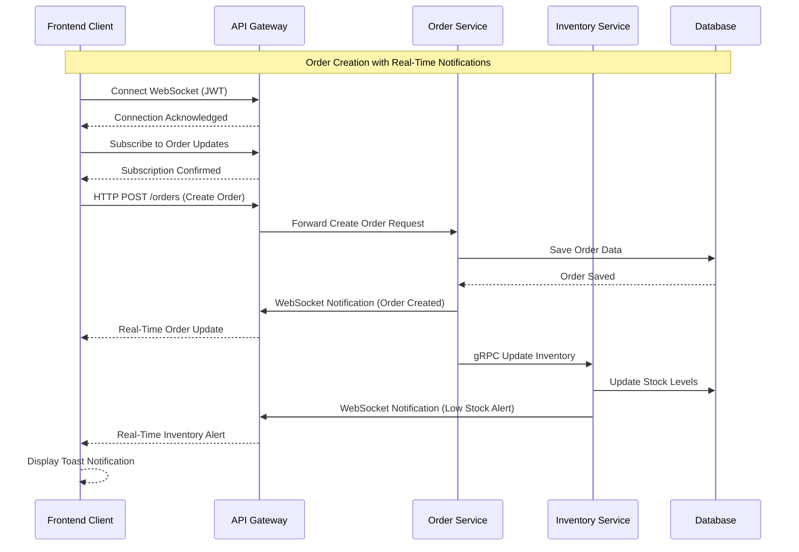

# OMS WebSocket Integration - End-to-End Guide

This comprehensive guide covers the complete WebSocket integration architecture, setup, and testing procedures for the OMS (Order Management System).

## 📋 Table of Contents

1. [Architecture Overview](#architecture-overview)
2. [System Requirements](#system-requirements)
3. [Setup Instructions](#setup-instructions)
4. [Running the Complete System](#running-the-complete-system)
5. [Testing WebSocket Functionality](#testing-websocket-functionality)
6. [Troubleshooting Guide](#troubleshooting-guide)
7. [API Reference](#api-reference)
8. [Production Deployment](#production-deployment)

---

## 🏗️ Architecture Overview

### High-Level Architecture

```
┌─────────────────────────────────────────────────────────────────────────────────┐
│                              OMS WebSocket Architecture                          │
└─────────────────────────────────────────────────────────────────────────────────┘

┌──────────────────┐    WebSocket     ┌──────────────────┐    gRPC/HTTP    ┌─────────────────┐
│                  │ ◄──────────────► │                  │ ◄──────────────► │                 │
│  Frontend Client │                  │   API Gateway    │                  │ Microservices   │
│                  │                  │  (WebSocket      │                  │                 │
│  - React App     │    HTTP/REST     │   Server)        │                  │ - Order Service │
│  - Socket.IO     │ ◄──────────────► │                  │                  │ - Inventory     │
│  - JWT Auth      │                  │ - Authentication │                  │ - Cart Service  │
│                  │                  │ - Event Routing  │                  │ - Auth Service  │
└──────────────────┘                  │ - CORS Handling  │                  │                 │
                                      └──────────────────┘                  └─────────────────┘
                                              │                                      │
                                              ▼                                      ▼
                                      ┌──────────────────┐                  ┌─────────────────┐
                                      │                  │                  │                 │
                                      │ Authentication   │                  │   Database      │
                                      │ & Authorization  │                  │   - PostgreSQL  │
                                      │ - JWT Validation │                  │   - Redis       │
                                      │ - Role-Based     │                  │                 │
                                      │   Permissions    │                  │   Message Queue │
                                      │                  │                  │   - Kafka       │
                                      └──────────────────┘                  └─────────────────┘
```

### Communication Flow



---

## 🔧 System Requirements

### Development Environment

- **Node.js**: 16.x or higher
- **npm**: 8.x or higher
- **TypeScript**: 4.9.x or higher
- **Docker**: For running infrastructure (optional)

### System Dependencies

```bash
# Check Node.js version
node --version  # Should be 16.x+

# Check npm version
npm --version   # Should be 8.x+

# Check Docker (optional)
docker --version
```

### Browser Requirements

- **Chrome**: 90+ (Recommended)
- **Firefox**: 88+
- **Safari**: 14+
- **Edge**: 90+

---

## 🚀 Setup Instructions

### Step 1: Install Dependencies

Navigate to the main OMS directory and install dependencies:

```bash
# Navigate to OMS root directory
cd /Users/kushalbhattacharya/Documents/PersonalProjects/OMS

# Install backend dependencies
npm install

# Install frontend client dependencies
cd frontend-websocket-client
npm install
```

### Step 2: Environment Configuration

#### Backend Configuration

Create/update the main `.env` file:

```bash
# From OMS root directory
cp .env.example .env

# Edit the .env file with your configuration
```

Required environment variables:

```bash
# WebSocket Configuration
SENTRY_DSN=your_sentry_dsn_here
JWT_SECRET=your_jwt_secret_key_here
CORS_ORIGIN=http://localhost:3001,http://localhost:3000

# Database Configuration
DATABASE_HOST=localhost
DATABASE_PORT=5432
DATABASE_USER=postgres
DATABASE_PASSWORD=postgres
DATABASE_NAME=oms

# API Gateway Configuration
API_GATEWAY_URL=http://localhost:3000

# Email Configuration (for Sentry integration)
EMAIL_NOTIFICATIONS_ENABLED=true
EMAIL_HOST=smtp.gmail.com
EMAIL_PORT=587
EMAIL_USER=your_email@gmail.com
EMAIL_PASSWORD=your_app_password
ORDER_NOTIFICATION_RECIPIENTS=admin@yourcompany.com
```

#### Frontend Configuration

```bash
# From frontend-websocket-client directory
cp .env.example .env

# Edit frontend environment variables
```

Frontend environment variables:

```bash
# WebSocket Server Configuration
REACT_APP_WEBSOCKET_URL=ws://localhost:3000

# API Gateway URL
REACT_APP_API_URL=http://localhost:3000

# Debug Mode (optional)
REACT_APP_DEBUG=false
```

### Step 3: Database Setup

If using Docker:

```bash
# From OMS root directory
docker-compose -f docker-compose.infra.yml up -d

# Wait for services to be ready
docker-compose -f docker-compose.infra.yml logs -f postgres
```

Or set up PostgreSQL locally and run migrations:

```bash
# Run database migrations
npm run migration:run
```

---

## 🏃‍♂️ Running the Complete System

### Option 1: Manual Startup (Recommended for Development)

#### Terminal 1: Start API Gateway with WebSocket Support

```bash
# From OMS root directory
cd apps/api-gateway

# Start API Gateway in development mode
npm run start:dev

# Expected output:
# 🚀 API Gateway starting with WebSocket support...
# 📡 WebSocket endpoint: ws://localhost:3000/events
# 🔗 HTTP API endpoint: http://localhost:3000
```

#### Terminal 2: Start Order Service

```bash
# From OMS root directory
cd apps/order

# Start Order Service in development mode
npm run start:dev

# Expected output:
# Order service listening on port 3002
# WebSocket client service initialized
```

#### Terminal 3: Start Other Required Services

```bash
# Start Auth Service (Terminal 3)
cd apps/auth
npm run start:dev

# Start Inventory Service (Terminal 4) 
cd apps/inventory
npm run start:dev

# Start Cart Service (Terminal 5)
cd apps/cart
npm run start:dev
```

#### Terminal 6: Start Frontend Client

```bash
# From OMS root directory
cd frontend-websocket-client

# Start React development server
npm start

# Expected output:
# webpack compiled successfully
# Local: http://localhost:3001
# On Your Network: http://192.168.x.x:3001
```

### Option 2: Docker Startup

```bash
# From OMS root directory

# Start infrastructure services
docker-compose -f docker-compose.infra.yml up -d

# Start application services
docker-compose -f docker-compose.app.yml up -d

# Start frontend client manually (in separate terminal)
cd frontend-websocket-client
npm start
```

### Verification Steps

1. **Check API Gateway Health**:
   ```bash
   curl http://localhost:3000/websocket/health
   ```

2. **Check WebSocket Connection**:
   ```bash
   # Install wscat globally (if not installed)
   npm install -g wscat
   
   # Test WebSocket connection (replace with valid JWT)
   wscat -c "ws://localhost:3000/events" -H "Authorization: Bearer YOUR_JWT_TOKEN"
   ```

3. **Check Frontend Access**:
   - Open browser to `http://localhost:3001`
   - Verify the OMS WebSocket Client loads

---

## 🧪 Testing WebSocket Functionality

### Step 1: Connect to WebSocket

1. **Open Frontend Client**: Navigate to `http://localhost:3001`

2. **Select Authentication Method**:
   - Click on one of the sample tokens (Admin User, Customer User, Staff User)
   - Or paste your own JWT token

3. **Connect**: Click "Connect to WebSocket"

4. **Verify Connection**: Check for green "Connected" status indicator

### Step 2: Subscribe to Events

1. **Enable Order Updates**:
   - Toggle the "Order Updates" switch to ON
   - Verify "Subscription confirmed" message

2. **Enable Inventory Alerts**:
   - Toggle the "Inventory Alerts" switch to ON
   - Verify "Subscription confirmed" message

### Step 3: Test Real-Time Events

#### Method 1: Using API Endpoints (Recommended)

**Test Order Creation Notification**:

```bash
# Create a new order via API Gateway
curl -X POST http://localhost:3000/websocket/notifications/order-created \
  -H "Content-Type: application/json" \
  -H "Authorization: Bearer YOUR_JWT_TOKEN" \
  -d '{
    "orderId": "123",
    "aliasId": "ORDER-2023-001",
    "userId": 1,
    "totalAmount": 99.99,
    "status": "created"
  }'
```

**Test Inventory Alert**:

```bash
# Send low stock alert
curl -X POST http://localhost:3000/websocket/notifications/inventory-alert \
  -H "Content-Type: application/json" \
  -H "Authorization: Bearer YOUR_JWT_TOKEN" \
  -d '{
    "productId": 101,
    "productName": "Test Product",
    "currentQuantity": 5,
    "threshold": 10,
    "alertType": "low_stock"
  }'
```

**Test System Broadcast**:

```bash
# Send system-wide notification
curl -X POST http://localhost:3000/websocket/broadcast \
  -H "Content-Type: application/json" \
  -H "Authorization: Bearer YOUR_JWT_TOKEN" \
  -d '{
    "type": "system",
    "title": "System Maintenance",
    "message": "Scheduled maintenance will begin at 2 AM UTC",
    "data": {
      "maintenanceTime": "2023-12-01T02:00:00Z",
      "estimatedDuration": "2 hours"
    }
  }'
```

#### Method 2: Using Actual Order Creation

**Create Order via Order Service**:

```bash
# First, create an order through the regular API
curl -X POST http://localhost:3000/order/orders \
  -H "Content-Type: application/json" \
  -H "Authorization: Bearer YOUR_JWT_TOKEN" \
  -d '{
    "addressId": 1,
    "items": [
      {
        "productId": 101,
        "quantity": 2,
        "price": 49.99
      }
    ]
  }'
```

### Step 4: Verify Frontend Response

After triggering events, verify in the frontend client:

1. **Toast Notifications**: Pop-up alerts should appear
2. **Event Tabs**: Check the appropriate tabs for new events
3. **Event Details**: Click on events to expand JSON details
4. **Connection Status**: Ping server to test connectivity

### Expected Frontend Behavior

```typescript
// Order Update Event
{
  type: "order_status",
  data: {
    orderId: "123",
    aliasId: "ORDER-2023-001", 
    status: "created",
    userId: 1,
    timestamp: "2023-12-01T12:00:00Z",
    message: "Order created successfully"
  },
  userId: 1,
  timestamp: "2023-12-01T12:00:00Z"
}

// Inventory Alert Event  
{
  type: "inventory_update",
  data: {
    productId: 101,
    quantity: 5,
    status: "low_stock",
    threshold: 10,
    timestamp: "2023-12-01T12:00:00Z"
  },
  timestamp: "2023-12-01T12:00:00Z"
}
```

---

## 🐛 Troubleshooting Guide

### Common Connection Issues

#### Issue 1: WebSocket Connection Failed

**Symptoms**:
- "Connection error" in frontend
- "Authentication failed" message
- Red connection status indicator

**Solutions**:

1. **Check API Gateway Status**:
   ```bash
   curl http://localhost:3000/websocket/health
   ```

2. **Verify JWT Token**:
   ```javascript
   // Decode JWT token to check validity
   const token = "your_jwt_token_here";
   const payload = JSON.parse(atob(token.split('.')[1]));
   console.log(payload);
   ```

3. **Check CORS Configuration**:
   ```bash
   # Verify API Gateway accepts frontend origin
   curl -H "Origin: http://localhost:3001" \
        -H "Access-Control-Request-Method: GET" \
        -H "Access-Control-Request-Headers: Authorization" \
        -X OPTIONS http://localhost:3000/websocket/health
   ```

#### Issue 2: No Events Received

**Symptoms**:
- WebSocket connected but no events appearing
- Subscription confirmed but events not received

**Solutions**:

1. **Check Subscriptions**:
   - Verify subscription toggles are ON
   - Check browser console for subscription confirmations

2. **Test Event Generation**:
   ```bash
   # Manual event trigger
   curl -X POST http://localhost:3000/websocket/notifications/order-created \
     -H "Content-Type: application/json" \
     -d '{"orderId":"test","aliasId":"TEST-001","userId":1,"totalAmount":10,"status":"created"}'
   ```

3. **Check Service Integration**:
   ```bash
   # Verify services are running
   curl http://localhost:3002/orders/health  # Order Service
   curl http://localhost:3001/auth/health    # Auth Service
   ```

#### Issue 3: Frontend Not Loading

**Symptoms**:
- Blank page or loading errors
- Console errors in browser

**Solutions**:

1. **Check Dependencies**:
   ```bash
   cd frontend-websocket-client
   npm install --legacy-peer-deps
   ```

2. **Clear Cache**:
   ```bash
   rm -rf node_modules package-lock.json
   npm install
   ```

3. **Check Environment Variables**:
   ```bash
   cat .env
   # Verify REACT_APP_WEBSOCKET_URL is set correctly
   ```

### Debug Mode

Enable detailed logging:

```bash
# Frontend debug mode
REACT_APP_DEBUG=true npm start

# Backend debug mode  
DEBUG=* npm run start:dev
```

### Log Analysis

**API Gateway Logs**:
```bash
# Look for these log patterns
[WebSocket] Client attempting to connect: socket_id
[WebSocket] Client authenticated as user X with role Y
[Sentry] Order creation alert triggered for order ORDER-123
```

**Frontend Console Logs**:
```javascript
// WebSocket connection logs
Connected to OMS WebSocket: {userId: 1, timestamp: "..."}
Subscription confirmed: {type: "order_updates", message: "..."}
Order update received: {type: "order_status", data: {...}}
```

---

## 📚 API Reference

### WebSocket Events

#### Client → Server Events

| Event | Description | Payload |
|-------|-------------|---------|
| `subscribe_to_orders` | Subscribe to order updates | None |
| `subscribe_to_inventory` | Subscribe to inventory alerts | None |
| `unsubscribe` | Unsubscribe from event type | `{type: 'order'|'inventory'}` |
| `ping` | Test connection | None |

#### Server → Client Events

| Event | Description | Payload |
|-------|-------------|---------|
| `connected` | Connection established | `{userId: number, timestamp: string}` |
| `subscription_confirmed` | Subscription successful | `{type: string, message: string}` |
| `order_update` | Order status changed | `RealTimeEvent` |
| `inventory_update` | Inventory level changed | `RealTimeEvent` |
| `user_notification` | User-specific message | `RealTimeEvent` |
| `system_notification` | System announcement | `RealTimeEvent` |

### REST API Endpoints

#### WebSocket Management

```http
GET    /websocket/health              # Health check
GET    /websocket/stats               # Connection statistics
GET    /websocket/users/{id}/online   # Check if user online
GET    /websocket/users/online        # List online users
POST   /websocket/broadcast           # Send notification
```

#### Event Triggers

```http
POST   /websocket/notifications/order-created         # Trigger order event
POST   /websocket/notifications/order-status-update   # Trigger status update  
POST   /websocket/notifications/inventory-alert       # Trigger inventory alert
```

### Data Structures

#### RealTimeEvent

```typescript
interface RealTimeEvent {
  type: 'order_status' | 'inventory_update' | 'system_notification' | 'user_specific';
  data: any;
  userId?: number;
  timestamp: string;
}
```

#### OrderStatusUpdate

```typescript
interface OrderStatusUpdate {
  orderId: string;
  aliasId: string;
  status: string;
  userId: number;
  timestamp: string;
  message?: string;
}
```

#### InventoryUpdate

```typescript
interface InventoryUpdate {
  productId: number;
  quantity: number;
  status: 'low_stock' | 'out_of_stock' | 'restocked';
  threshold?: number;
  timestamp: string;
}
```

---

## 🚀 Production Deployment

### Environment Configuration

#### Production Environment Variables

```bash
# API Gateway Production Config
NODE_ENV=production
JWT_SECRET=your_secure_production_secret
CORS_ORIGIN=https://your-frontend-domain.com
SENTRY_DSN=https://your-production-sentry-dsn@sentry.io/project

# Database Production Config  
DATABASE_HOST=your-production-db-host
DATABASE_PORT=5432
DATABASE_USER=oms_user
DATABASE_PASSWORD=secure_password
DATABASE_NAME=oms_production

# SSL Configuration
SSL_ENABLED=true
SSL_CERT_PATH=/path/to/ssl/cert
SSL_KEY_PATH=/path/to/ssl/key
```

#### Frontend Production Build

```bash
cd frontend-websocket-client

# Set production environment
REACT_APP_WEBSOCKET_URL=wss://your-api-domain.com
REACT_APP_API_URL=https://your-api-domain.com

# Build for production
npm run build

# Deploy to static hosting (example with nginx)
cp -r build/* /var/www/html/websocket-client/
```

### Docker Production Deployment

```yaml
# docker-compose.prod.yml
version: '3.8'
services:
  api-gateway:
    image: oms-api-gateway:latest
    ports:
      - "443:3000"
    environment:
      - NODE_ENV=production
      - JWT_SECRET=${JWT_SECRET}
      - CORS_ORIGIN=${FRONTEND_URL}
    volumes:
      - ./ssl:/app/ssl:ro
    
  frontend:
    image: nginx:alpine
    ports:
      - "80:80"
      - "443:443"
    volumes:
      - ./frontend-build:/usr/share/nginx/html
      - ./nginx.conf:/etc/nginx/nginx.conf
      - ./ssl:/etc/nginx/ssl:ro
```

### Load Balancer Configuration

For high-availability WebSocket deployments:

```nginx
# nginx.conf
upstream websocket_backend {
    ip_hash;  # Sticky sessions for WebSocket
    server api-gateway-1:3000;
    server api-gateway-2:3000;
}

server {
    listen 443 ssl;
    server_name your-api-domain.com;
    
    # WebSocket upgrade handling
    location /events {
        proxy_pass http://websocket_backend;
        proxy_http_version 1.1;
        proxy_set_header Upgrade $http_upgrade;
        proxy_set_header Connection "upgrade";
        proxy_set_header Host $host;
        proxy_set_header X-Real-IP $remote_addr;
        proxy_set_header X-Forwarded-For $proxy_add_x_forwarded_for;
        proxy_set_header X-Forwarded-Proto $scheme;
    }
    
    # Regular HTTP API
    location /websocket/ {
        proxy_pass http://websocket_backend;
        proxy_set_header Host $host;
        proxy_set_header X-Real-IP $remote_addr;
        proxy_set_header X-Forwarded-For $proxy_add_x_forwarded_for;
        proxy_set_header X-Forwarded-Proto $scheme;
    }
}
```

### Monitoring Setup

#### Health Check Endpoints

```bash
# Kubernetes health checks
livenessProbe:
  httpGet:
    path: /websocket/health
    port: 3000
  initialDelaySeconds: 30
  periodSeconds: 10

readinessProbe:
  httpGet:
    path: /websocket/health
    port: 3000
  initialDelaySeconds: 5
  periodSeconds: 5
```

#### Metrics Collection

```javascript
// Add to API Gateway
app.get('/metrics', (req, res) => {
  const stats = webSocketService.getConnectionStats();
  res.json({
    connectedClients: stats.connectedClients,
    authenticatedUsers: stats.authenticatedUsers,
    uptime: process.uptime(),
    memoryUsage: process.memoryUsage()
  });
});
```

---

## 📊 Performance Optimization

### WebSocket Connection Limits

```javascript
// API Gateway configuration
const server = new Server(httpServer, {
  maxHttpBufferSize: 1e6,  // 1MB
  pingTimeout: 60000,      // 60 seconds
  pingInterval: 25000,     // 25 seconds
  upgradeTimeout: 10000,   // 10 seconds
  maxEventListeners: 100,
});
```

### Frontend Optimization

```javascript
// Event throttling
const throttledEventHandler = useMemo(
  () => throttle(handleEvent, 100), // Max 10 events/second
  []
);

// Memory management  
useEffect(() => {
  return () => {
    webSocketService.disconnect();
    // Clean up event listeners
  };
}, []);
```

### Database Connection Pooling

```javascript
// TypeORM configuration
{
  type: "postgres",
  host: process.env.DATABASE_HOST,
  port: parseInt(process.env.DATABASE_PORT),
  username: process.env.DATABASE_USER,
  password: process.env.DATABASE_PASSWORD,
  database: process.env.DATABASE_NAME,
  synchronize: false,
  logging: process.env.NODE_ENV === 'development',
  extra: {
    max: 20,           // Maximum connections
    min: 5,            // Minimum connections
    acquireTimeout: 10000,
    idleTimeout: 30000,
  }
}
```

---

## 🔐 Security Considerations

### JWT Token Security

```javascript
// Token validation middleware
const validateJWT = async (token) => {
  try {
    const decoded = jwt.verify(token, process.env.JWT_SECRET);
    // Add additional validation logic
    return decoded;
  } catch (error) {
    throw new UnauthorizedException('Invalid token');
  }
};
```

### Rate Limiting

```javascript
// WebSocket rate limiting
const rateLimitMap = new Map();

const checkRateLimit = (socketId, limit = 100) => {
  const now = Date.now();
  const userLimits = rateLimitMap.get(socketId) || { count: 0, resetTime: now + 60000 };
  
  if (now > userLimits.resetTime) {
    userLimits.count = 0;
    userLimits.resetTime = now + 60000;
  }
  
  if (userLimits.count >= limit) {
    throw new Error('Rate limit exceeded');
  }
  
  userLimits.count++;
  rateLimitMap.set(socketId, userLimits);
};
```

### CORS Security

```javascript
// Production CORS configuration
const corsOptions = {
  origin: process.env.CORS_ORIGIN.split(','),
  credentials: true,
  optionsSuccessStatus: 200,
  methods: ['GET', 'POST', 'PUT', 'DELETE'],
  allowedHeaders: ['Content-Type', 'Authorization'],
};
```

---

## 📞 Support & Maintenance

### Logging Configuration

```javascript
// Winston logger setup
const logger = winston.createLogger({
  level: process.env.NODE_ENV === 'production' ? 'info' : 'debug',
  format: winston.format.combine(
    winston.format.timestamp(),
    winston.format.errors({ stack: true }),
    winston.format.json()
  ),
  transports: [
    new winston.transports.File({ filename: 'error.log', level: 'error' }),
    new winston.transports.File({ filename: 'combined.log' }),
    new winston.transports.Console()
  ]
});
```

### Backup Procedures

```bash
# Database backup
pg_dump -h $DATABASE_HOST -U $DATABASE_USER -d $DATABASE_NAME > oms_backup_$(date +%Y%m%d_%H%M%S).sql

# Configuration backup
tar -czf config_backup_$(date +%Y%m%d).tar.gz \
  .env docker-compose*.yml nginx.conf ssl/
```

### Update Procedures

```bash
# Rolling update procedure
1. Update code repository
2. Build new Docker images
3. Update services one by one
4. Verify WebSocket connectivity
5. Monitor error rates
6. Rollback if issues detected
```

---

## 🎯 Conclusion

This end-to-end guide provides complete instructions for:

- ✅ **Setting up the WebSocket architecture**
- ✅ **Running all system components**
- ✅ **Testing real-time functionality** 
- ✅ **Troubleshooting common issues**
- ✅ **Deploying to production**
- ✅ **Monitoring and maintenance**

The OMS WebSocket integration provides a robust, scalable solution for real-time communication across your order management system. The frontend client serves as both a testing tool and a reference implementation for building WebSocket-enabled applications.

For additional support, refer to the individual component documentation and check the troubleshooting section for common issues and solutions.